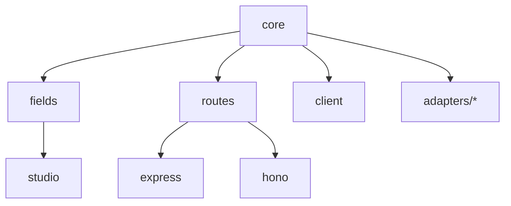

# 🚀 Trokky v2 Private Beta Deployment Checklist

## 📋 Pre-Deployment Setup

### ✅ Repository Preparation
- [x] Clean build artifacts and temporary files (`npm run clean`)
- [x] Update `.gitignore` with production exclusions
- [x] Configure package.json files with GitHub Packages settings
- [x] Add CI/CD pipeline configuration
- [x] Create installation documentation

### 🔧 Package Configuration
Each package needs:
- [x] Proper `files` array (only `dist` folder)
- [x] `publishConfig` for GitHub Packages
- [x] Repository and homepage URLs
- [x] Correct `main`, `types`, and `exports` fields
- [x] Version consistency across packages

### 📦 Distribution Files
Only these files should be included in packages:
- `dist/` - Compiled TypeScript output
- `package.json` - Package metadata
- `README.md` - Package documentation
- `LICENSE` - License file

## 🏗️ GitHub Repository Setup

### 1. Run Setup Script
```bash
./scripts/setup-private-repo.sh
```

This script will:
- Create private repository on GitHub
- Configure packages for GitHub Packages
- Set up CI/CD workflows
- Push initial codebase

### 2. Manual GitHub Configuration

#### Repository Settings
- [ ] Set repository to **Private**
- [ ] Enable **GitHub Packages**
- [ ] Configure **branch protection** for main
- [ ] Add **team access** for beta users

#### Secrets Configuration
Add these secrets in GitHub repository settings:
- [ ] `GITHUB_TOKEN` (automatic, for packages publishing)

#### Team Access Setup
- [ ] Create "Beta Testers" team in Trokky organization
- [ ] Add team to repository with **Read** access
- [ ] Invite beta users to team

## 📦 Package Publishing Strategy

### Version Management
- Use semantic versioning: `0.1.0-beta.1`, `0.1.0-beta.2`, etc.
- Changelogs managed with `@changesets/cli`
- Automated publishing via GitHub releases

### Publishing Process
1. **Development** → Push to `main` branch
2. **Testing** → CI runs tests and builds
3. **Release** → Create GitHub release
4. **Publishing** → Packages auto-published to GitHub Packages

### Package Dependencies


## 🔒 Private Access Management

### GitHub Packages Setup
- [x] Configure packages with `@trokky` scope
- [x] Set registry to `https://npm.pkg.github.com`
- [x] Mark packages as `restricted` access

### Client Access Requirements
Beta users need:
1. **GitHub account** with access to Trokky organization
2. **Personal Access Token** with `packages:read` permission
3. **Proper `.npmrc`** configuration in their projects

### Access Control Levels
- **Organization Owners**: Full access, can manage packages
- **Beta Testers Team**: Read access to packages
- **Individual Contributors**: Case-by-case repository access

## 📋 Client Installation Flow

### 1. Beta User Onboarding
```bash
# 1. Get access to Trokky organization
# 2. Create GitHub Personal Access Token
# 3. Configure .npmrc
echo "@trokky:registry=https://npm.pkg.github.com
//npm.pkg.github.com/:_authToken=TOKEN_HERE" > .npmrc

# 4. Install packages
npm install @trokky/core @trokky/express
```

### 2. Project Setup
```typescript
// Quick start example
import { TrokkyExpress } from '@trokky/express'

const trokky = await TrokkyExpress.create({
  schemas: [/* your schemas */],
  storage: { adapter: 'filesystem' }
})

trokky.mount(app)
```

## 🧪 Beta Testing Strategy

### Test Scenarios
- [ ] **Fresh Installation** - New project setup
- [ ] **Package Updates** - Version upgrades
- [ ] **Multiple Environments** - Dev, staging, production
- [ ] **Different Configurations** - Various adapters and setups

### Feedback Collection
- [ ] GitHub Issues for bug reports
- [ ] Private Discord for real-time support
- [ ] Structured feedback forms
- [ ] Regular check-ins with beta users

## 📊 Monitoring & Analytics

### Package Usage Tracking
- GitHub Packages download statistics
- Installation success/failure rates
- Version adoption tracking

### Support Metrics
- Issue response times
- Resolution rates
- User satisfaction scores

## 🔄 Update & Maintenance Process

### Regular Updates
1. **Weekly** - Security patches and critical fixes
2. **Bi-weekly** - Feature updates and improvements
3. **Monthly** - Major version updates

### Communication Channels
- Release notes in GitHub releases
- Announcements in beta Discord
- Email notifications for critical updates

## 🎯 Success Criteria

### Technical Metrics
- [ ] Successful installations in 3+ client projects
- [ ] <24h average issue resolution time
- [ ] >95% uptime for demo environments

### User Experience
- [ ] Positive feedback from beta users
- [ ] Successful real-world implementations
- [ ] Documentation clarity and completeness

## 🚀 Go-Live Preparation

### Before Public Release
- [ ] All beta feedback addressed
- [ ] Comprehensive documentation complete
- [ ] Performance benchmarking done
- [ ] Security audit completed
- [ ] Support infrastructure ready

### Migration to Public
- [ ] Move packages to public npm registry
- [ ] Update all documentation
- [ ] Launch marketing materials
- [ ] Community support channels

---

## 📞 Emergency Contacts

- **Technical Issues**: Create GitHub issue
- **Access Problems**: Contact organization admin
- **Critical Bugs**: Direct message on Discord

**Status**: Ready for private beta deployment 🎉