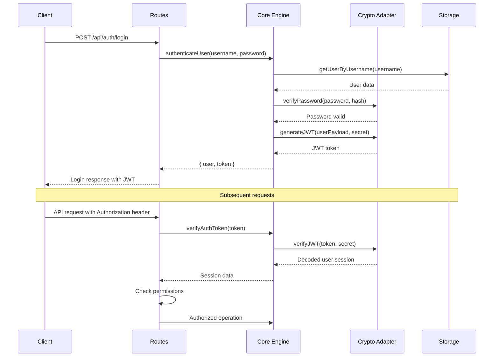

# Trokky v2 - Architecture Specification

## 🏗️ System Architecture Overview

Trokky v2 follows a **composable, modular architecture** that prioritizes developer experience, flexibility, and maintainability. The system is designed as a collection of focused packages that work together seamlessly while remaining independently useful.

## 📦 Package Architecture

### Core Packages

```
@trokky/core          # CMS engine and business logic
@trokky/routes        # Framework-agnostic HTTP handlers  
@trokky/studio        # React-based admin interface
@trokky/client        # Frontend SDK and type generation
```

### Integration Packages

```
@trokky/express       # Express.js server integration
@trokky/nextjs        # Next.js App Router integration
@trokky/cloudflare    # Cloudflare Workers integration
@trokky/hono          # Hono edge runtime integration
```

### Storage Adapters

```
@trokky/adapter-filesystem    # File-based storage (default)
@trokky/adapter-cloudflare    # Cloudflare D1 + R2 storage  
@trokky/adapter-s3            # AWS S3 + DynamoDB storage
```

## 🧠 Core Package (`@trokky/core`)

The heart of the CMS system - handles all business logic, validation, and storage coordination.

### Architecture

```typescript
// Core engine class
export class TrokkyCore {
  private storage: StorageAdapter
  private schemas: SchemaRegistry
  private validator: DocumentValidator
  private cryptoAdapter: CryptoAdapter
  private auditLogger?: (event: AuditEvent) => void

  constructor(config: TrokkyConfig, options: TrokkyCoreOptions = {}) {
    this.storage = createStorageAdapter(config.storage)
    this.schemas = new SchemaRegistry(config.schemas)
    this.cryptoAdapter = options.cryptoAdapter || detectCryptoAdapter(options.cryptoOptions)
    this.validator = new DocumentValidator(this.schemas)
  }

  // Document operations
  async getDocument(collection: string, id: string): Promise<Document>
  async saveDocument(collection: string, data: DocumentData): Promise<Document>
  async listDocuments(collection: string, options?: ListOptions): Promise<Document[]>
  async deleteDocument(collection: string, id: string): Promise<void>

  // Media operations
  async uploadMedia(file: File): Promise<MediaFile>
  async getMedia(id: string): Promise<MediaFile>
  async deleteMedia(id: string): Promise<void>

  // Schema operations
  getSchema(name: string): ContentSchema
  validateDocument(collection: string, data: any): ValidationResult
}
```

### Key Components

**Schema Registry**
- Loads and validates TypeScript schema definitions
- Provides schema introspection for GraphQL generation
- Handles schema versioning and migrations

**Document Validator**
- Runtime validation using schema definitions
- Type-safe validation errors
- Custom validation rules support

**Storage Interface**
- Abstract interface for storage operations
- Pluggable adapter system
- Consistent API across storage types

**User Management System**
- JWT-based authentication with role-based access control
- bcrypt password hashing with configurable salt rounds
- Multi-environment crypto adapters (Node.js, Web Crypto API, fallback)
- Comprehensive audit logging for security compliance

**Crypto Adapter System**
- Environment-aware cryptographic operations
- Node.js adapter: bcrypt + jsonwebtoken (maximum security)
- Web Crypto adapter: PBKDF2 + HMAC-SHA256 (edge-compatible)
- Fallback adapter: Development-only with security warnings

**Audit & Security**
- Built-in security event tracking
- Configurable audit logging for enterprise compliance
- Rate limiting and DoS protection
- Input validation and sanitization

## 🛣️ Routes Package (`@trokky/routes`)

Framework-agnostic HTTP route definitions and handlers that can be adapted to any web framework.

### Design Philosophy

```typescript
// Pure handler functions - no framework dependencies
type TrokkyHandler = (request: TrokkyRequest) => Promise<TrokkyResponse>

// Framework-agnostic request/response interfaces
interface TrokkyRequest {
  method: string
  path: string
  params: Record<string, string>
  query: Record<string, string>
  body: any
  headers: Record<string, string>
  context: { trokky: TrokkyCore }
}

interface TrokkyResponse {
  status: number
  data: any
  headers?: Record<string, string>
}
```

### Route Definitions

```typescript
// Auto-generated route registry
export const TrokkyRoutes = {
  // Document routes
  'GET /api/documents/:collection': DocumentHandlers.list,
  'POST /api/documents/:collection': DocumentHandlers.create,
  'GET /api/documents/:collection/:id': DocumentHandlers.get,
  'PUT /api/documents/:collection/:id': DocumentHandlers.update,
  'DELETE /api/documents/:collection/:id': DocumentHandlers.delete,

  // Media routes
  'POST /api/media/upload': MediaHandlers.upload,
  'GET /api/media/:id': MediaHandlers.get,
  'DELETE /api/media/:id': MediaHandlers.delete,

  // GraphQL endpoint
  'POST /api/graphql': GraphQLHandlers.query,
  'GET /api/graphql': GraphQLHandlers.playground,

  // Studio routes
  'GET /studio/*': StudioHandlers.serveStatic,
} as const
```

### Handler Implementation

```typescript
export const DocumentHandlers = {
  async list(request: TrokkyRequest): Promise<TrokkyResponse> {
    const { collection } = request.params
    const { limit, offset, filter } = request.query
    const core = request.context.trokky

    try {
      const documents = await core.listDocuments(collection, {
        limit: parseInt(limit) || 50,
        offset: parseInt(offset) || 0,
        filter: filter ? JSON.parse(filter) : undefined
      })

      return {
        status: 200,
        data: documents
      }
    } catch (error) {
      return {
        status: error.status || 500,
        data: { error: error.message }
      }
    }
  },

  async create(request: TrokkyRequest): Promise<TrokkyResponse> {
    const { collection } = request.params
    const core = request.context.trokky

    // Validate document against schema
    const validation = core.validateDocument(collection, request.body)
    if (!validation.valid) {
      return {
        status: 400,
        data: { error: 'Validation failed', details: validation.errors }
      }
    }

    try {
      const document = await core.saveDocument(collection, request.body)
      return {
        status: 201,
        data: document
      }
    } catch (error) {
      return {
        status: error.status || 500,
        data: { error: error.message }
      }
    }
  }

  // ... other handlers
}
```

## 🔗 Integration Pattern

Each framework integration follows the same adapter pattern:

### Express Integration

```typescript
// @trokky/express/src/index.ts
import express from 'express'
import { TrokkyRoutes, createTrokkyContext } from '@trokky/routes'
import { TrokkyCore } from '@trokky/core'

export function createExpressApp(config: TrokkyConfig): express.Application {
  const app = express()
  const core = new TrokkyCore(config)

  // Middleware
  app.use(express.json())
  app.use(createTrokkyContext(core))

  // Auto-register all routes
  Object.entries(TrokkyRoutes).forEach(([methodPath, handler]) => {
    const [method, path] = methodPath.split(' ')
    
    app[method.toLowerCase()](path, async (req, res) => {
      const trokkyRequest = adaptExpressRequest(req)
      const trokkyResponse = await handler(trokkyRequest)
      
      res.status(trokkyResponse.status)
      if (trokkyResponse.headers) {
        res.set(trokkyResponse.headers)
      }
      res.json(trokkyResponse.data)
    })
  })

  return app
}

function adaptExpressRequest(req: express.Request): TrokkyRequest {
  return {
    method: req.method,
    path: req.path,
    params: req.params,
    query: req.query,
    body: req.body,
    headers: req.headers,
    context: req.trokky // Added by middleware
  }
}
```

### Next.js Integration

```typescript
// @trokky/nextjs/src/index.ts
import { TrokkyRoutes, findMatchingRoute } from '@trokky/routes'
import { TrokkyCore } from '@trokky/core'

export function createNextJSHandler(config: TrokkyConfig) {
  const core = new TrokkyCore(config)

  return async function handler(req: NextRequest) {
    const route = findMatchingRoute(req.method, req.url, TrokkyRoutes)
    
    if (!route) {
      return new Response('Not Found', { status: 404 })
    }

    const trokkyRequest = await adaptNextRequest(req, core)
    const trokkyResponse = await route.handler(trokkyRequest)

    return new Response(JSON.stringify(trokkyResponse.data), {
      status: trokkyResponse.status,
      headers: {
        'Content-Type': 'application/json',
        ...trokkyResponse.headers
      }
    })
  }
}
```

## 💾 Storage Architecture

### Storage Adapter Interface

```typescript
interface StorageAdapter {
  // Document operations
  getDocument(collection: string, id: string): Promise<Document | null>
  saveDocument(collection: string, id: string, data: DocumentData): Promise<Document>
  listDocuments(collection: string, options?: ListOptions): Promise<Document[]>
  deleteDocument(collection: string, id: string): Promise<void>

  // Media operations
  uploadFile(file: File, metadata: MediaMetadata): Promise<MediaFile>
  getFile(id: string): Promise<MediaFile | null>
  deleteFile(id: string): Promise<void>

  // Utility operations
  healthCheck(): Promise<boolean>
  migrate(migrations: Migration[]): Promise<void>
}
```

### Filesystem Adapter (Default)

```typescript
// @trokky/adapter-filesystem/src/index.ts
export class FilesystemAdapter implements StorageAdapter {
  constructor(private config: FilesystemConfig) {}

  async getDocument(collection: string, id: string): Promise<Document | null> {
    const filePath = path.join(this.config.contentDir, collection, `${id}.json`)
    
    if (!await fs.pathExists(filePath)) {
      return null
    }

    const content = await fs.readJSON(filePath)
    return {
      id,
      ...content,
      _collection: collection,
      _createdAt: (await fs.stat(filePath)).birthtime,
      _updatedAt: (await fs.stat(filePath)).mtime
    }
  }

  async saveDocument(collection: string, id: string, data: DocumentData): Promise<Document> {
    const collectionDir = path.join(this.config.contentDir, collection)
    await fs.ensureDir(collectionDir)

    const filePath = path.join(collectionDir, `${id}.json`)
    const isNew = !await fs.pathExists(filePath)

    const document: Document = {
      id,
      ...data,
      _collection: collection,
      _createdAt: isNew ? new Date() : (await this.getDocument(collection, id))?._createdAt,
      _updatedAt: new Date()
    }

    await fs.writeJSON(filePath, document, { spaces: 2 })
    return document
  }

  // ... other methods
}
```

### Cloudflare Adapter

```typescript
// @trokky/adapter-cloudflare/src/index.ts
export class CloudflareAdapter implements StorageAdapter {
  constructor(
    private d1: D1Database,
    private r2: R2Bucket
  ) {}

  async getDocument(collection: string, id: string): Promise<Document | null> {
    const result = await this.d1
      .prepare('SELECT * FROM documents WHERE collection = ? AND id = ?')
      .bind(collection, id)
      .first()

    return result ? JSON.parse(result.data) : null
  }

  async uploadFile(file: File, metadata: MediaMetadata): Promise<MediaFile> {
    const key = `${metadata.id}.${metadata.extension}`
    
    await this.r2.put(key, file.stream(), {
      httpMetadata: {
        contentType: file.type,
        cacheControl: 'public, max-age=31536000'
      }
    })

    return {
      id: metadata.id,
      url: `${this.config.publicUrl}/${key}`,
      ...metadata
    }
  }

  // ... other methods
}
```

## 🎨 Studio Architecture

Modern React application with modular component system.

### Component Architecture

```typescript
// Component hierarchy
Studio/
├── Layout/
│   ├── Header          # Navigation, user menu, search
│   ├── Sidebar         # Structure navigation
│   └── MainContent     # Document editing area
├── Documents/
│   ├── DocumentList    # Collection browsing
│   ├── DocumentEditor  # Form-based editing
│   └── DocumentPreview # Real-time preview
├── Media/
│   ├── MediaBrowser    # File browsing and upload
│   ├── MediaEditor     # Crop, resize, metadata
│   └── MediaPicker     # Field integration
└── Settings/
    ├── SchemaManager   # Schema configuration
    ├── UserManager     # User and permissions
    └── SystemSettings  # General configuration
```

### State Management

```typescript
// React Context for global state
interface StudioContextValue {
  // Core instances
  core: TrokkyCore
  apiClient: ApiClient
  
  // Current state
  currentDocument: Document | null
  currentCollection: string | null
  
  // UI state
  sidebarOpen: boolean
  theme: 'light' | 'dark'
  
  // Actions
  setCurrentDocument: (doc: Document) => void
  toggleSidebar: () => void
  showNotification: (message: string, type: 'success' | 'error') => void
}
```

## 🔧 Configuration System

### Single Configuration File

```typescript
// trokky.config.ts
export default defineConfig({
  // Storage configuration
  storage: {
    adapter: 'filesystem', // or 'cloudflare', 's3'
    options: {
      contentDir: './content',
      mediaDir: './media'
    }
  },

  // Schema definitions
  schemas: './schemas/**/*.ts',

  // Studio configuration
  studio: {
    title: 'My CMS',
    url: '/studio',
    structure: './studio.structure.ts'
  },

  // API configuration
  api: {
    basePath: '/api',
    cors: true,
    graphql: {
      endpoint: '/api/graphql',
      playground: process.env.NODE_ENV === 'development'
    }
  },

  // Development settings
  dev: {
    port: 3000,
    watch: true,
    typeGeneration: true
  }
})
```

## 🚀 Performance Considerations

### Schema Loading
- Lazy loading of schema definitions
- Cached schema compilation
- Incremental type generation

### API Performance
- Response caching for GET requests
- Optimized database queries
- Efficient GraphQL resolvers

### Studio Performance
- Code splitting for large applications
- Virtual scrolling for large lists
- Optimistic updates for better UX

## 🔒 Security Architecture

Trokky v2 implements enterprise-grade security with a comprehensive authentication and authorization system.

### Authentication Flow



### Multi-Environment Crypto System

```typescript
// Automatic adapter selection based on environment
export function detectCryptoAdapter(options: CryptoAdapterOptions = {}): CryptoAdapter {
  if (isNodeEnvironment()) {
    return new NodeCryptoAdapter(options)     // bcrypt + jsonwebtoken
  }
  
  if (hasWebCrypto()) {
    return new WebCryptoAdapter(options)      // PBKDF2 + HMAC-SHA256
  }
  
  return new FallbackCryptoAdapter(options)   // Development only (with warnings)
}
```

**Environment Compatibility:**
- **Node.js**: Uses bcrypt (12 salt rounds) + jsonwebtoken for maximum security
- **Cloudflare Workers**: Uses Web Crypto API with PBKDF2 + HMAC-SHA256
- **Deno**: Native Web Crypto API support
- **Vercel Edge**: Web Crypto API compatible
- **Fallback**: Development mode with security warnings

### Role-Based Access Control (RBAC)

```typescript
// User roles and permissions
type UserRole = 'admin' | 'editor' | 'viewer'

type Permission = 
  | 'read'              // View content
  | 'write'             // Create/edit content  
  | 'delete'            // Delete content
  | 'manage_users'      // User management
  | 'manage_settings'   // System settings
  | 'upload_media'      // Media upload
  | 'delete_media'      // Media deletion

// Default role permissions
const rolePermissions = {
  admin: ['read', 'write', 'delete', 'manage_users', 'manage_settings', 'upload_media', 'delete_media'],
  editor: ['read', 'write', 'upload_media'],
  viewer: ['read']
}
```

### Security Validation Pipeline

```typescript
// Request validation flow
async function validateRequest(request: HttpRequest): Promise<void> {
  // 1. Input sanitization
  SecurityValidator.validateCollectionName(request.params.collection)
  SecurityValidator.validateDocumentId(request.params.id)
  SecurityValidator.validateDocumentData(request.body)
  
  // 2. Authentication check
  if (authenticationRequired) {
    const token = extractBearerToken(request.headers.authorization)
    const session = await core.verifyAuthToken(token)
    if (!session) throw new UnauthorizedError()
  }
  
  // 3. Authorization check  
  if (adminRequired) {
    const hasAccess = session.role === 'admin' || 
                     session.permissions.includes('manage_users')
    if (!hasAccess) throw new ForbiddenError()
  }
  
  // 4. Rate limiting
  await rateLimiter.checkRateLimit(request.ip)
}
```

### Audit & Compliance Logging

```typescript
// Comprehensive audit events
interface AuditEvent {
  type: 'user_created' | 'user_updated' | 'user_deleted' | 'user_login' | 'admin_access'
  userId?: string
  targetUserId?: string  
  username?: string
  action: string
  timestamp: string
  ipAddress?: string
  userAgent?: string
  success: boolean
  details?: Record<string, unknown>
}

// Automatic audit logging
core.logAuditEvent({
  type: 'user_login',
  userId: user.id,
  username: user.username,
  action: 'User authenticated successfully',
  timestamp: new Date().toISOString(),
  success: true,
  details: { role: user.role, lastLoginAt: new Date().toISOString() }
})
```

### Password Security

- **bcrypt hashing** with 12 salt rounds (Node.js environments)
- **PBKDF2** with SHA-256 and 4096 iterations (edge environments)
- **Password strength validation** with complexity requirements
- **Automatic weak password detection** with detailed feedback
- **Secure random salt generation** for each password

### Data Protection

- **JWT tokens** cryptographically signed with HMAC-SHA256
- **Token expiration** configurable (default 24h)
- **Secure random generation** for secrets and salts
- **Path traversal protection** in file operations
- **Input sanitization** preventing injection attacks
- **CORS security** with configurable origins
- **Rate limiting** preventing DoS attacks

### Development vs Production Security

**Development Mode:**
- Environment-based admin user creation
- Detailed security warnings and guidance
- Fallback crypto adapter with prominent warnings
- Verbose audit logging

**Production Mode:**
- Mandatory strong passwords with complexity validation
- Secure JWT secret requirement (`TROKKY_JWT_SECRET`)
- Automatic crypto adapter selection for maximum security
- Audit logging with configurable enterprise integrations

---

This architecture ensures Trokky v2 is both powerful and maintainable, providing the flexibility developers need while maintaining simplicity and performance.